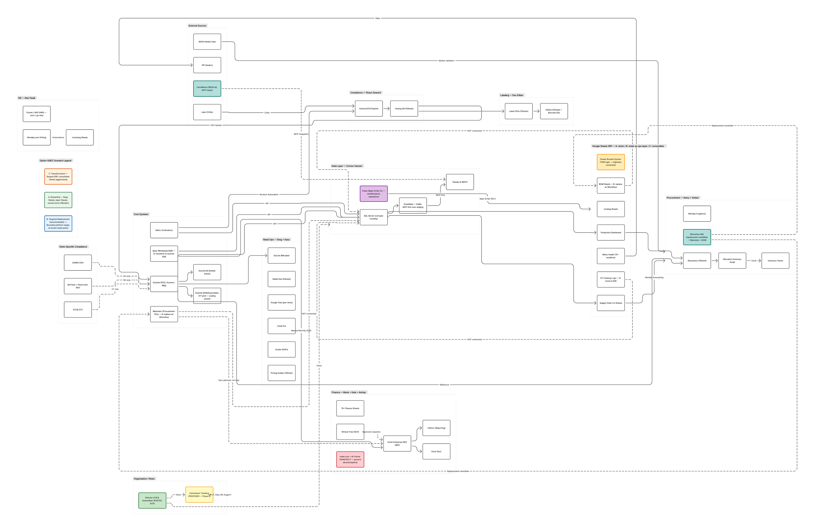

# Theory Wellness

## Data, Systems & AI Discovery — Monday 4/20 Overview

**Prepared by:** Adam Freed, Freed Solutions
**For:** Eddie Benjamin (CPO), Theory Wellness
**Date:** April 20, 2026
**Source:** 18 stakeholder interviews (March 23 – April 15, 2026); Liz Murphy's Useful Links inventory (4/9/26 PDF); Theory Wellness Full Data & Systems Flow Figma sitemap (30 systems).

---

## Executive Summary

The engagement's SOW asked us to map Theory's workflows, identify AI and automation opportunities, and deliver a prioritized roadmap. Eighteen stakeholder interviews later, the operating picture is clear, and it's broader than the original framing suggested.

Six broad categories name the landscape. A three-phase framework puts them on a Crawl → Walk → Run timeline for Year 1. A set of open questions defines the conversation backbone for the next thirty days.

The central recommendation: Theory should rebuild its data and systems foundation in parallel with AI deployment rather than layering AI on top of the current ecosystem. On the 4/15 wrap-up, Eddie named this exactly — the current Claude rollout risks being "another tool" without a centralized framework. That recognition is the strongest possible signal for foundation-first work. It also sets up the single most important Year 1 question: *where do we want Theory's tech stack to land in two to three years?*

Everything in this document is organized around that question. The Figma sitemap at the end of this document is the decision canvas for answering it.

---

## The Reframe

The SOW framed the engagement as documentation: map what exists, spot where AI fits, hand over a roadmap. That framing holds, but it understates the work. Discovery surfaced a consistent root issue across every function: executive data strategy is not landing at the operational level because the *how* (process, ownership, rhythm) and the *who* (training, roles, concentration risk) have received much less attention than the *what* (tools, dashboards, platforms). Layering AI onto that state amplifies noise faster than it reduces it.

Four Theory executives independently described the same picture. Amber Cook: *"top 1–5% of cannabis industry for data sophistication, unsophisticated tech stack."* Liz Murphy validated the same framing in her 4/13 follow-up. Connor Hansen echoed it from the data manager seat. Eddie confirmed it on 4/15 and went further, acknowledging that the current Claude rollout is "layering on another tool" without proper foundation. That four-way alignment at the top is the most valuable operating condition of this engagement — the strategic diagnosis is already shared.

What remains is the execution sequence. The Month-1 objective this document recommends is not *what tools should we buy*. It is *where do we want to land*. The specific tech-stack decisions for the next two to three years should be made deliberately, with explicit waypoints and scenario alternatives, before any large-scale platform swap begins. The Figma sitemap is the visual canvas for that decision work.

The SOW is honored here; this framing extends it, with Eddie's explicit 4/15 buy-in.

---

## Broad Categories

Six themes emerged from discovery. Each one was surfaced by multiple stakeholders independently; the convergence count is the primary signal. These are not findings invented to fill space — they are what Theory's own people said, unprompted, across eighteen conversations.

### A. No Centralized IT or Tech Organization

The strongest single-theme convergence in the engagement. Four people named it directly without prompting: Matt Gerety (VP Retail) called for a "centralized data intelligence / BI function as a new IT-led business unit." Shaun Seward (Compliance) writes Python automation from inside Compliance because there is no tech organization to own it. Alex Paulk (HR) runs an entire HRIS migration and ATS workaround with no peer IT team. Greg Phillips (Retail Ops) functions as Theory's de facto retail field IT. Kass Kazimierczak's summary: *"Need an IT department. Our team, mainly Greg, supports the company's needs with all IT-related hardware and software, which is difficult to maintain at the standard I/we would like because we are focused on so much more than IT."* Eddie validated the theme directly on 4/15.

The downstream effects are visible across the org. Shadow IT shows up in Finance: Connor 4/10 and Ashley Wright 4/9 independently confirmed make.com is being used without IT approval. Security fragments by state and by store; Maine isn't even on the same provider stack as other markets (Kass). Connor Hansen would prefer an IT role over a production role but no such function exists to grow into. AI governance, onboarding/offboarding protocol, and tooling standards have no home.

**The Director of Business Intelligence & Automation role posted on 4/15 is Theory's first concrete move toward the centralized function this gap has been calling for.** Every other category in this document ladders back up to this one.

### B. Disparate Data and Google Sheets Sprawl

Theory runs on Google Sheets as a lightweight ERP. That is not a criticism — in cannabis, it is standard — but the sprawl has reached a scale that creates material business risk. Matt Gerety estimated roughly eighteen new sheets are created daily across the org. Mark Youngworth called the ecosystem *"plugs off of plugs — you find out by accident"* — powerful but undiscoverable and unscalable.

Two datapoints from separate meetings crystallize the trust problem. In the same 4/10 Finance session, Amber Cook and Marie Preshong gave different answers to the same question about "L60" because the rolling-60-day definition varies by team ("last month plus nine days" versus actual last 60 days). Separately, Avery Ferrusi described a Supply Chain 2.0 sheet error that went undetected for a full year; when it surfaced, it required full reallocation across stores. Connor Hansen independently confirmed the same incident from the data manager seat. People are making Monday-morning buying decisions against numbers nobody has audited.

Specific structural gaps also showed up: BOM sheets, Finished Goods tracking logs, and Mainstem (procurement) data are not in SQL Server. The Production Dashboard operates as a *de facto software platform* — supply chain, production, and compliance all live in it daily. None of that is wrong in kind; it is the scale that has outgrown the architecture.

### C. Sophisticated Data Strategy on Unsophisticated Software

Eddie's own framing on 4/15. Amber Cook (4/9), Connor Hansen (4/10), and Liz Murphy (4/13) used the same language independently before Eddie repeated it — a four-way alignment at the executive level that does not require any further validation.

The infrastructure side of this theme is the most urgent to name, because it is the load-bearing gap beneath every other fix. Internet at *all* Theory locations is slow enough to impact productivity org-wide and cause data tools to be abandoned (Amber 4/9, Connor 4/10 confirmed). Hardware is underpowered: no one has laptops that run multiple dashboards reliably, and complex Sheets with thousands of rows cause crashes (Connor 4/10: "processing speed is the biggest bottleneck"). Monthly SQL file corruption is a known-and-lived recurrence. Operations staff walk around with laptops trying to view fifty-column sheets on poor internet, and data tools never land at the operational level as a result.

**Executive data vision exists but cannot be executed at the ground-floor operational level.** No amount of software consolidation, AI integration, or governance work will matter if the physical infrastructure cannot support it. This is not glamorous work, but it gates everything else.

### D. "How" Before "What": the Methodology Spine

Theory's executive team has moved faster on the *what* (tools, outputs, platforms) than on the *how* (processes, rhythms, ownership) or the *who* (roles, training, concentration). Mark Youngworth's framing — *"Framework first. Where do we want to land?"* — was echoed by Liz Murphy, Connor Hansen, Amber Cook, and Adam. When that alignment exists and the *how* and *who* are attended to first, the *what* usually resolves itself; when the *what* leads, the *how* and *who* end up as orphaned post-implementation work that nobody has the bandwidth to own.

The consequence: AI on broken systems amplifies noise. Three stakeholders flagged this independently without prompting — Connor Hansen 4/10, Amber Cook, and Matt Gerety. Liz Murphy 4/13 extended the point: *training Claude to replicate manual workarounds creates token cost without solving root problems.* The goal is eliminating sheets and processes, not automating them.

This category is the methodology spine of the framework in the next section. Phase 0 is the "how" and "who" work.

### E. AI Already in Production, Unevenly

Theory is not starting from zero on AI; the distribution is just uneven. Shaun Seward runs a Python / OCR pipeline that logs into Metrc via browser automation and scrapes COAs into testing sheets — lab-agnostic by design. Dan Killian's labeling pipeline runs AI-assisted QC in production today. Connor Hansen is standing up Snowflake + MCP for a Claude agent (hit an API connection issue recently). Kass Kazimierczak uses Gemini for in-call note-taking in Retail Ops. Each of these is valuable on its own; none share a framework yet.

Mark Youngworth's defining stance is worth quoting directly: *"AI is a better Admin than Strategic Mind."* And his thesis for why more hasn't happened: *"So much rich data, no one is using it. Founders are wary of their data."* Mark is right on both counts. The opportunity is not to invent new AI from scratch; it is to codify what already works, extend it deliberately, and put a centralized framework around it.

Eddie self-acknowledged the missing framework on 4/15. The incoming Director of Business Intelligence & Automation is the natural owner.

### F. Succession and Concentration Risk

Two people function as the "glue" layer of Theory's current operation, and the org has not fully recognized the risk. Sean McGonagle operates as the connector between Production and Retail — he provides preliminary allocation recommendations and lets departments make final calls. Avery Ferrusi fills a parallel role between third-party purchasing and in-house demand — and, critically, is functioning as Theory's de facto demand planner because that role was eliminated and never backfilled. Avery's own framing of the opportunity: *"Don't need to hire someone new?"* — meaning AI-assisted demand planning could replace the unfilled headcount. That is dollar-quantifiable.

The concentration extends to data infrastructure. Dashboards live in personal Google Drives across Connor Hansen, Liz Murphy, and Dan Killian. Connor has said he would prefer an IT role over a production role; the org has people who want to staff a centralized data/IT function but no such function exists to grow into. This theme is primarily an org-design risk — it does not require new tooling to solve, but it does require explicit role design in the Year 1 plan.

---

## Rough Framework: Year 1

Three phases, on a Crawl → Walk → Run timeline. The execution cycle inside each phase follows what Amber Cook described as Theory's own best pattern: **Design → Train & Buy-In → Execute → Review**. Mark Youngworth's phrasing — *"Framework first. Where do we want to land?"* — is the spine.

### Phase 0 — Foundation (Crawl)

The prerequisites to everything else. Nothing in Phases 1 and 2 survives without this layer in place.

- **Centralized ticketing system.** Four independent endorsements (Judge 3/27, Connor 4/10, Liz 4/13, Eddie 4/15) make this the single highest-convergence foundational item in the engagement. The system covers HR, IT, data requests, and business support. The ticketing analytics produce frequent-flyer patterns that feed SOP work and AI use-case prioritization downstream.
- **Director of BI & Automation hire.** Already in flight via the 4/15 Indeed / LinkedIn posting. This is the first concrete build of the centralized tech organization. The scope, reporting line, and relationship to embedded tech-savvy individuals (Shaun, Alex, Dan, Greg + Kass, Connor) are open questions for the next thirty days (see Questions section).
- **Infrastructure remediation.** Internet, hardware, and baseline training across all Theory locations. This is not glamorous work; it is load-bearing. Amber 4/9 and Connor 4/10 independently surfaced the gap. It should be sequenced ahead of, or in parallel with, any major tool rollout.
- **AI communication SOPs.** Liz Murphy's 4/13 operating principle: *training Claude to replicate manual workarounds creates token cost without solving root problems.* The organization needs a shared vocabulary around when and how to use Claude before the tool sprawl accelerates.
- **Master data dedup and cleanup.** Foundation work that should run in parallel with ticketing stand-up. Production currently owns internal MDM and Compliance owns third-party/wholesale MDM; the split needs to be reconciled in any centralized data strategy.

### Phase 1 — Tech-Stack Decision Waypoints (Walk)

This is the Month-1 deep-work phase. The Figma sitemap is the canvas. Liz Murphy's 4/13 framing — three explicit tech-stack scenarios rather than a single "what should we buy" answer — is the structure.

The question each scenario answers is *where Theory's tech stack should land in two to three years*, not *what to buy next quarter*.

#### Option A — Streamline

**Posture:** Minimal platform change. Keep the current Google Sheets ecosystem, layer Claude on top for cleanup and consolidation, sunset the worst-offender sheets over time. Sage X3 and ERP conversations stay off the table.

**Pros:** Lowest change management cost. Preserves institutional knowledge. Moves quickly on AI gains.

**Cons:** Does not address the BOM / FG / Mainstem gaps in SQL Server. Infrastructure problems remain. Kicks the platform-consolidation decision to Year 2 at higher eventual cost.

**When this wins:** If the priority is near-term AI productivity gains and the organization wants to defer platform bets until more of the AI landscape matures.

#### Option B — Targeted Replacement *(recommended)*

**Posture:** Specific, bounded platform swaps at the known weak points. Evaluate Wherefour as a Mainstem and BOM replacement (Amber's direction). Time the Apex → Dutchie B2B transition deliberately as Dutchie matures. Adopt MCP-first architecture over Snowflake staging where possible (Eddie's 4/15 preference signal). Leave Google Sheets as the operational layer, but move BOM, FG logs, and procurement out of it. Continue the dual approach — streamline + Claude — for everything else.

**Pros:** Addresses the specific data-in-SQL-Server gaps that Theme B named. Matches the four-way executive alignment on foundation-first. Preserves optionality on full ERP without committing to it. Aligns with the AI-paired development direction already underway. Enables Year 2 AI use cases (demand planning, AP reconciliation) to run on clean data.

**Cons:** Requires disciplined waypoint-setting to avoid scope creep into a full ERP program. Needs a committed owner (the incoming Director) to drive platform evaluations end-to-end.

**Why this is the recommendation:** It honors Marie Preshong's question — *"why invest in a major ERP if AI eliminates the need in 6–8 months?"* — without defaulting to Option A's "do nothing on platforms." It aligns with Liz Murphy's dual-approach guidance. It matches Adam's own conviction, Eddie's self-acknowledged 4/15 framing, and the cross-stakeholder "how before what" consensus. Most importantly, it is deliverable by a newly hired Director inside Year 1 without requiring an ERP program management office.

#### Option C — Transformative

**Posture:** Reopen the ERP conversation. Revisit Sage Intacct and Acumatica (evaluated and passed two years ago — Marie, Amber, Liz independently corroborated the history). Consolidate the Sheets ecosystem aggressively. Build a proper analytics platform underneath. Use Claude as the productivity accelerant on top of a new foundation.

**Pros:** Clean-room architecture. Scales cleanly into Years 3–5. Positions Theory as a best-in-class MSO for data infrastructure.

**Cons:** Marie's ambivalence (*"not sure I would support ERP"*) is a real signal of executive-level hesitation. The 2-year-ago evaluation died on price + buy-in, and the buy-in question is not fully resolved. ERP programs at cannabis MSOs have a poor track record; Adam has personally seen one go wrong with millions wasted and the wrong system selected. Requires a dedicated PMO and displaces AI work for 12+ months during implementation.

**When this wins:** If Theory decides the long-term architecture payoff is worth the 12–18 months of displaced focus, and if executive buy-in on ERP can be resolved.

#### Specific decisions that gate all three options

Regardless of path, a handful of specific decisions sit inside Phase 1 and should be resolved early:

- **Flower bracket system.** Liz Murphy 4/13: the TWX-style bracket logic built in 2021 (e.g., `TWX-1` = 0–2599g, 30%+ THC, 69% to eighths) is *too intricate to migrate to Monday.com*. It is the single most complex piece of logic in the Sheets ecosystem. Any consolidation plan has to answer "what replaces the bracket system" before it can claim to consolidate.
- **Dutchie BOM / assemblies pilot (VT).** Amber has identified scaling issues: cannot scale batch sizes, BOM-by-category is not robust enough, needs BOM-by-product-line. Pair this evaluation with the Wherefour decision.
- **Sheets → Monday consolidation.** Liz's link inventory quantified the current split: Inbound Transportation is 100% Monday across all 5 states, Production Dashboards are 100% Sheets, and Production Schedules are mixed. This is not preference drift; it is two parallel systems each owning distinct operational domains with no bridge. Consolidation is a supply-chain-wide architecture call, not a compliance/retail preference.

### Phase 2 — Process and AI Rollout (Run)

Phase 2 is where the Phase 0 foundation and Phase 1 platform decisions pay off. AI deployment happens here, but against clean data and defined ownership.

- **AI replacements for unfilled roles where dollar-quantifiable.** Avery Ferrusi's Monday-morning manual state-by-state demand forecasting is the clearest case. The demand-planner role was eliminated and the work absorbed by procurement; AI demand planning can replace the headcount cost. This is Theory's dollar-quantifiable AI opportunity.
- **Master data harmonization at scale.** Production-owned MDM (internal SKUs) and Compliance-owned MDM (third-party/wholesale SKUs) reconciled into a shared taxonomy. The Dutchie global catalog evolution will inform timing.
- **AP requisition-to-payment lifecycle.** Marie Preshong's #1 priority. Each state runs its own AP inbox handling approximately 1,700 emails per month. The consolidation path across QBO, IES, Mineral Tree, and the state inboxes is Phase 2 work because the MDM foundation must be in place first.
- **Ticketing analytics feedback loop.** The centralized ticketing data from Phase 0 produces patterns — frequent-flyer questions, recurring issues, common requests — that become the prioritization list for AI use cases. This closes the Design → Train → Execute → Review loop.

---

## Questions for Future Conversations

These are the open questions that shape Phase 1. They are not blockers; they are the conversation backbone for the next thirty days with Eddie and the executive team. Each group represents a decision area where discovery surfaced the question but not the answer.

### IT and Tech Organization

- What is the full scope of the Director of BI & Automation role? Does it own centralized ticketing, master data management, and AI governance, or only BI and automation?
- Reporting line: direct to CPO, direct to CEO, or peer to the current embedded tech-savvy individuals?
- What is the organizational relationship between the new Director and the embedded tech-savvy individuals today (Shaun, Alex, Dan, Greg + Kass, Connor)? Dotted-line, hard-line, or a full org restructure?
- When does IT move out of Retail Operations (Greg + Kass) and into the new central function? With what timeline and transition plan?

### ERP vs. Dual-Path

- Marie Preshong's personal ambivalence (*"not sure I would support ERP"*) versus stronger team-level buy-in than two years ago — where is the firm executive-level ground on ERP?
- Which of Options A / B / C does Eddie want as the working assumption going into Phase 1 scenario detail? (This document recommends Option B.)
- What categorically requires an ERP versus what can be solved via streamline + Claude? Specifically: compliance reporting, multi-entity consolidation, and BOM-by-product-line are the acid tests.

### Production and Supply Chain

- Production → Allocation handoff: what is the explicit trigger mechanism between Finished Goods status and the allocation sheets? Currently covered conceptually, not mapped.
- Vault dwell time (5–7 days): who owns the delay — procurement, retail, or space and capacity? Avery has documented the effect but the ownership is unclear.
- Wholesale outgoing flow: what moves to Dutchie B2B on what timeline, and what stays in Apex through the transition?
- Co-manufacturing in Apex: which specific pieces are Wherefour candidates, and which stay in Apex?
- BOM-by-product-line versus BOM-by-category: the Dutchie VT pilot limitation pairs with the flower bracket system decision.

### Retail and Data

- EOD reporting: who consumes the 13-store manager rollup daily, and what decisions does it actually drive? Currently 50–80% completeness per Greg; worth understanding the value delivered before investing in improvements.
- Promotion workflow: Sean McGonagle recommends, marketing decides, Dutchie executes. Kass is the de facto discount and pricing owner per Eddie's 4/6 note. Who owns the SOP for the full cycle?
- **Accessories / Apparel / Merch** is an unowned category creating monthly G.S. reconciliation overhead (Amber handwritten). Where does it live organizationally — Retail, Marketing, or a new category owner?

### Finance

- Costing sheet integration into QB/IES: what is the post-Fathom architecture? Current workaround is Fathom + Excel Sync inheriting IES limitations.
- AP requisition-to-payment consolidation path across the five state AP inboxes — does this belong in Phase 2, or accelerate earlier?
- Shadow IT in Finance (make.com + Air Parser): govern it, absorb it into a central automation layer, or replace with the ticketing + Director's new automation standard?

### AI Governance

- Who sets the centralized framework Eddie self-flagged as missing on 4/15? Director of BI & Automation, or a dedicated AI lead?
- When and how should teams use Claude? Liz Murphy 4/13 flagged AI education as a critical success factor; shared vocabulary is the prerequisite to wider adoption.
- Which of the production AI workflows today (Shaun's COA pipeline, Dan's label QC, Connor's Snowflake MCP, Kass's Gemini) become reference architectures that other teams adopt, and which stay as idiosyncratic one-offs?

---

## Tech Stack Sitemap — Phase 1 Decision Canvas

The sitemap below is the companion artifact to this document. It maps Theory's ~30 tracked systems across Compliance, Production, Labeling, Supply Chain & Procurement, Finance, HR, Retail Ops, and Data & BI, with three overlays that turn the inventory into a Phase 1 decision tool.

A full-resolution version is attached alongside this document as `Theory Wellness — Phase 1 Decision Canvas (30+ Systems, A_B_C Scenarios).pdf`. The Mermaid source is versioned in the engagement repo and regenerates the Figma board on demand through a Claude session with Figma rendering access.

The three overlays:

1. **Option A / B / C scenario treatment.** Each node color-badged for the three Phase 1 tech-stack scenarios: **A = Streamline** (green, retain), **B = Targeted Replacement** (blue, this document's recommendation), **C = Transformative** (orange, reopen ERP). See *Rough Framework → Phase 1* above for scenario definitions.

2. **SaaS replacement candidates.** Wherefour IMS shown as a dashed-link replacement candidate for Mainstem and the BOM sheets. Apex flagged for transition to Dutchie B2B as Dutchie's B2B matures. make.com + Air Parser flagged as Finance shadow IT, pending a Phase 1 govern / absorb / replace decision. CannMenus shown as an MCP-ready BDSA alternative under evaluation.

3. **Post-Marie integration.** The sitemap reflects Meetings 16 (Liz Murphy 4/13), 17 (Connor Hansen 4/10), and 18 (Eddie Benjamin 4/15). New system nodes: Wherefour IMS, make.com + Air Parser, Clasp (Apps Script SDLC). New role / proposed nodes: Director of BI & Automation (role posted 4/15, first concrete move toward centralized IT); Centralized Ticketing (Phase 0 proposed, four-way endorsement from Judge / Connor / Liz / Eddie). Overlay annotations: flower bracket system consolidation constraint (Liz 4/13), MCP-first architecture preference (Eddie 4/15).

The Mermaid source is the living source of truth for the diagram going forward. Updates from Phase 1 conversations should flow into the Mermaid file; the Figma rendering regenerates on demand.

---

## SOW Alignment

The SOW committed to three deliverables. All three are met, with the reframe extending the third.

| SOW commitment | How it's delivered |
| --- | --- |
| Map technology landscape | Figma sitemap (30 systems, refreshed through Eddie 4/15) + the Categories section above |
| Identify AI and automation opportunities | Category E (uneven AI in production) + Category F (succession / concentration) + Phase 2 initiatives |
| Deliver prioritized roadmap | Rough Framework (Phase 0 → Phase 1 → Phase 2) with Option A/B/C scenarios inside Phase 1 |

The reframe extends the third commitment by adding the tech-stack decision waypoints — *where do we want to land in 2–3 years?* — as the Month-1 north star. Eddie's 4/15 self-acknowledgment validated this extension. The SOW's original shape is preserved; nothing is removed.

---

## Next Steps

The immediate path forward follows the discovery-to-recommendations-to-hiring sequence we discussed on 4/15:

1. **Review and align** on the Option A/B/C framing and the Phase 1 specific decisions flagged above. This document recommends Option B; Eddie's working assumption should be locked before Phase 1 scenario detail is developed.
2. **Director of BI & Automation hiring decision** — unblocked now that discovery has wrapped. This is Theory's own decision to make, and this document is structured to give the incoming Director a clean starting point regardless of the specific hire.
3. **Phase 0 kick-off** — Centralized ticketing scoping, infrastructure remediation planning, and AI SOP drafting can begin immediately and do not depend on the Director hire.
4. **Phase 1 scenario detail** — once Option A / B / C is locked, the sitemap decision canvas is refreshed with the chosen scenario's specific platform decisions and a waypoint-by-waypoint plan is built.

The Figma sitemap remains the live working document for all of the above. Updates from future conversations should flow back into it so that Theory's decision context is always one file.

---

*Prepared by Adam Freed, Freed Solutions, April 20, 2026. Grounded in eighteen stakeholder interviews conducted March 23 – April 15, 2026. Companion artifact: Theory Wellness Full Data & Systems Flow Figma sitemap.*
