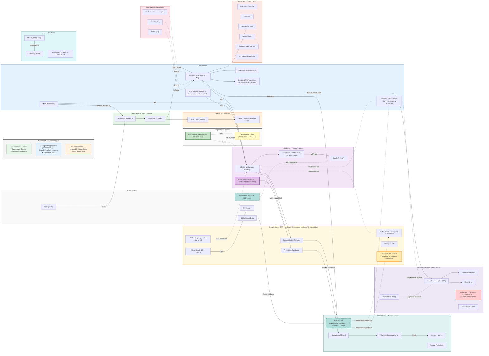

# Theory Wellness — Phase 1 Decision Canvas (Mermaid Source)
# Last updated: April 18, 2026
# Usage: Paste this into a Claude session and say "regenerate" or "update X node" to iterate via Figma:generate_diagram

